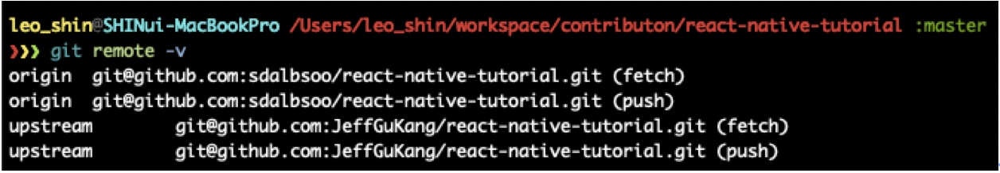

대학생이 되고 나서 첫 공모전인 공개 SW컨트리뷰톤에 나갔다.

참여하게 된 계기는 6월부터 8월까지 React-Native(이하 RN)를 공부했는데 마침 내 친형이 SW컨트리뷰톤에서 RN관련 프로젝트가 있다하여 신청하게 되었다.

또한 공모전이라는 것을 꼭 한번 나가보고 싶었고 다양한 사람들을 만나보고 싶어서 신청하였다.

신청마감 이틀 전에 알게 되어서 부족한 자기소개서를 채워서 마감 2시간전에 이메일을 보냈다.

그렇게 시간이 지나서 8월 29일에 문자가 왔는데 React Native Tutorial 프로젝트의 참가자로 선정되었다고 문자가 왔다. 그렇게 내 첫 공모전 프로젝트가 시작되었다.

## 첫 모임

역시나 첫 모임은 어색하고 뭐가 뭔지 하나도 모르는 길 잃은 양 같았다. 하지만 정말 설레였다.

선릉점 WeWork에서 첫 모임을 가졌는데 다른 프로젝트 팀의 멘토분들을 만났고 작년 18컨트리뷰톤의 멘토분들이 오셔서 해야 하는지 간략히 발표하는 시간도 있었다.

그런 시간을 가진 뒤 각 팀끼리 모여서 서로 만남을 가졌고 나는 RN Tutorial 팀으로 갔다.

자리에 착석했고... 시간이 지나고 어색한 기류가 흐르려고 했던 순간 멘토님께서 한분 한분 말을 걸어주었고 그 뒤에 저녁식사인 피자를 먹으면서 다양한 이야기를 나누었다.

그렇게 첫 모임이 끝났고 모임에서 이야기한 것을 토대로 우리 팀은 Slack으로 팀별 회의를 진행하고 각 팀별로 팀장을 뽑아서 이끌어 가는 것으로 이번 프로젝트를 시작하기로 했다.

## 1 ~ 4 주차

1 ~ 3주차는 각 팀별로 팀장을 뽑고 PR을 날리거나 git이 익숙하지 않은 분들을 위해서 쓰는 법을 알려주는 시간을 가졌다.

이 시간이 정말 이 공개SW컨트리뷰톤의 장점이 아닌가 생각한다.

4주차까지 배운 것을 정리해보면 아래와 같다.
(물론 협업 뿐만 아니라 RN도 배웠지만 기본 지식이 있기 때문에 생략함)

### 기본설정
upstream 등록 명령어: `git remote add upstream [git@github.com:sdalbsoo/example] or [Use https]`

 

 
위의 과정을 하고 `git remote -v`명령어를 치면 origin과 upstream을 확인할 수 있다.
 
  

### Git을 통한 협업 과정
 
1. Upstream(주 레포지토리)에 issue생성. (issue는 에러, 버그, 추가해야 할 것을 추가하는 곳)
아래는 이번 공모전(React Native tutorial)에 있는 issue들이다. 이 곳에서 New Issue버튼을 눌러서 issue를 생성하면 된다.

  
 
1. 작업하고 있는 branch로 이동 후, `git fetch upstream`을 통해 최신 변경 사항을 반영한다. 
    1. `git checkout [branch]`
    2. `(branch…) git fetch upstream`
만약 최신 변경 사항이 있다면 아래와 같이 뜰 것이다. (변경된 사항들이 반영된 것을 확인 할 수 있다.)
  
최신 변경 사항이 없다면 아래와 같다.
  

3. upstream/tutorial/basic 브랜치로부터 현재 로컬에 issue number에 해당하는 작업 브랜치를 생성한다. (issue-number가 없다면 붙이지 않아도 된다.)

`git checkout -b 5-branch-name –track upstream/tutorial/basic`

---

### 협업하는 과정의 순서

1) 소스 코드 수정

`git add -A`: 모든 변경 사항을 stage에 반영한다.
`git add .`: 삭제된 파일을 제외하고 나머지 파일의 새롭게 생기거나 변경된 사항을 stage에 반영한다.
--> `git add -A`를 쓰기를 권장. 

2) 변경 사항 commit 하기.  (`git commit -m “Add example commit”`) 
+ 추가 변경 사항 커밋. (`git commit -m “Add example commit”`)
2-1) (커밋 정리를 하고 싶다면…. `git rebase -I HEAD~2`를 해서 커밋 정리도 할 수 있음… squash라고 한다.)

3) push 하기 전에 최신 사항 반영 rebase!! (`git pull –rebase upstream [현재 작업하는 브랜치 명]`)
-> 다른 과정도 중요하지만 이 3번은 가장 중요하다. 왜냐하면 이 작업을 안하면 **conflict**(충돌)가 일어날 가능성이 농후해 지기 때문.

4) 본인 fork 레포인 origin에 push (`git push origin`) <=> (`git push <원격 저장소 url의 별명> <push할 브랜치 이름>`)

5) 본인 origin Github에서 5-branch-name이라는 브랜치를 upstream/branch (메인 레포지토리에 push하고 싶은 브랜치)에 PR을 생성한다.

6) 레포를 관리하는 사람 혹은 일원들이 리뷰 후… 승인(Approve)을 하면 브랜치 관리자 (maintainter)가 merge.

7) Merge 이후 branch삭제. (github 사이트에서…)

그런 뒤 `git pull upstream <master or branch명>`을 하면 그 브랜치의 최신 반영 분이 update된 것을 확인할 수 있다.

`git state`를 하면 406개의 commit이 앞에 존재한다고 했고…
 
`git pull upstream master`를 해서 반영했다… (현재 master브랜치가 주 branch이다.)
 
그러면 아래와 같이 commit의 수가 증가 됨을 볼 수 있다.
 
---

## 4주차 ~ 6주차

4주차에서 6주차에는 RN에 있는 router 예제를 만드는데 사용하고 문서 작성하는데 시간을 썼다.

하지만 학교 중간고사 기간과 겹쳐서... 많은 시간을 들이지 못한 것에 아쉬움이 남는다.

RN router 예제 코드 실행은 아래와 같다.

  

## SW Contributon 회고...

멘티분들과 멘토이신 JeffGuKang 만나 정말 다행이었다. 정말 잘해주셨고 질문을 하면 정말 친절하게 알려주셨다. 정말 정말 잘해주셨다. 특히 발표날에 발표를 하신 유덕님이 수고를 많이 하셨고 끝내주게 발표를 하셨다. (발표 뿐만이 아니라 질문에 답변도 잘해주셨다.)

RN팀은 처음에 인원이 13명에서 2명만 빠진 11명(어쩔수 없는 이유로 빠지셨다.ㅠ)이 전부 Github 사용법을 알게되었고 좋은 결과(장려상)까지 있게 된 거 같다.

SW Contributon이 끝났다고 나의 개발생활이 끝난 것이 아니니 틈틈히 기여 혹은 리뷰를 할 것이다.

이 글을 통해 다시 말하지만... 멘티, 멘토분들한테 고맙고 감사하다.

[ReactNative tutorial-JeffGuKang](https://github.com/JeffGuKang/react-native-tutorial)

  

